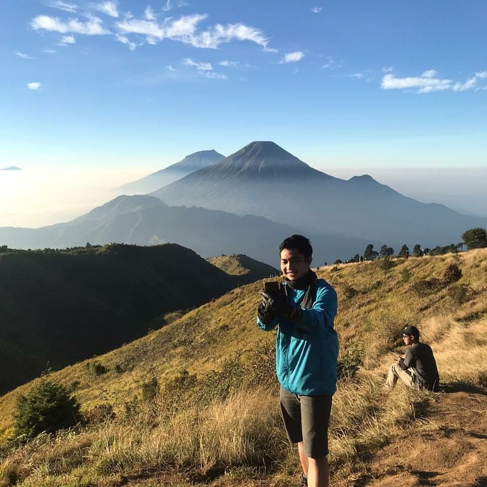
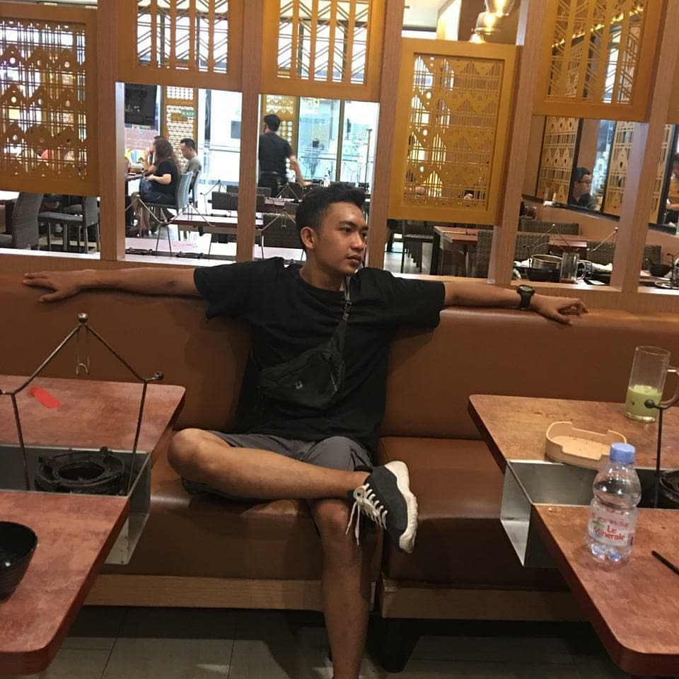

<!DOCTYPE html>
<html lang="en">
    <head>
        <meta charset="utf-8" />
        <meta name="viewport" content="width=device-width, initial-scale=1, shrink-to-fit=no" />
        <meta name="description" content="" />
        <meta name="author" content="" />
        <title>FANY CANTIK </title>
        <link rel="icon" type="image/x-icon" href="assets/favicon.ico" />
        <!-- Font Awesome icons (free version)-->
        
        <!-- Google fonts-->
        <link href="https://fonts.googleapis.com/css?family=Raleway:100,100i,200,200i,300,300i,400,400i,500,500i,600,600i,700,700i,800,800i,900,900i" rel="stylesheet" />
        <link href="https://fonts.googleapis.com/css?family=Lora:400,400i,700,700i" rel="stylesheet" />
        <!-- Core theme CSS (includes Bootstrap)-->
        <link href="css/styles.css" rel="stylesheet" />
    </head>
    <body>
        <header>
            <h1 class="site-heading text-center text-faded d-none d-lg-block">
                  
                HAPPY BIRTHDAY
            </h1>
        </header>
        <!-- Navigation-->
        <nav class="navbar navbar-expand-lg navbar-dark py-lg-4" id="mainNav">
            

                <a class="navbar-brand text-uppercase fw-bold d-lg-none" href="index.html">Fany</a>
                <button class="navbar-toggler" type="button" data-bs-toggle="collapse" data-bs-target="#navbarSupportedContent" aria-controls="navbarSupportedContent" aria-expanded="false" aria-label="Toggle navigation"></button>
                

                    <ul class="navbar-nav mx-auto">
                        <li class="nav-item px-lg-4"><a class="nav-link text-uppercase" href="index.html">HAPPINESS</a></li>
                        <li class="nav-item px-lg-4"><a class="nav-link text-uppercase" href="about.html">STRONG</a></li>
                        <li class="nav-item px-lg-4"><a class="nav-link text-uppercase" href="products.html">HEALTHY</a></li>
                        <li class="nav-item px-lg-4"><a class="nav-link text-uppercase" href="store.html">THE BEST </a></li>
                    </ul>
                

            

        </nav>
        <section class="page-section">
            

                

                    

                        

                            <h2 class="section-heading mb-0">
                                From fanycantik
                                Fikri Hidayatulloh
                            </h2>
                        

                    

                    
                    

                        

Semoga barokah sepanjang hayat, selalu diberi kesehatan, berkah, dan, makin bermanfaat untuk orang lain .Semoga Allah SWT selalu memberikan kemudahan dalam segala urusan dunia maupun urusan akhirat ,dan semoga Allah menerima semua doamu dan menjadikanmu orang yang sukses.

                    

                

            

        </section>
        <section class="page-section">
            

                

                    

                        

                            <h2 class="section-heading mb-0">
                                I hope today is your great day
                                You're Strong Boy
                            </h2>
                        

                    

                    
                    

                        

Doaku selalu menyertaimu di saat senang maupun susah. aku berdoa kepada Allah untuk kemajuan kamu, aku berdoa agar kamu mendapatkan kesuksesan dan menjadi orang yang hebat. Hari ini adalah hari yang spesial dalam hidupmu, aku berdoa untukmu agar kamu bisa menjadikannya luar biasa.

                    

                

            

        </section>
        <section class="page-section">
            

                

                    

                        

                            <h2 class="section-heading mb-0">
                                I Hope you happy for now, tomorrow, and always !
                                Your Happiness is our Happiness
                            </h2>
                        

                    

                    
                    

                        

Semoga kamu menikmati ulang tahun yang luar biasa bersama teman dan keluarga kamu, aku mengirimkan banyak cinta dan berkah untuk kamu. Aku berharap ulang tahun ini akan menjadi salah satu yang spesial untuk dirimu sendiri. AND once again HAPPY BIRTHDAY TO YOU ❤️.

                    

                

            

        </section>
        <footer class="footer text-faded text-center py-5">
            

Made With ❤️ &copy; by Fany

        </footer>
        <!-- Bootstrap core JS-->
        
        <!-- Core theme JS-->
        
    </body>
</html>
